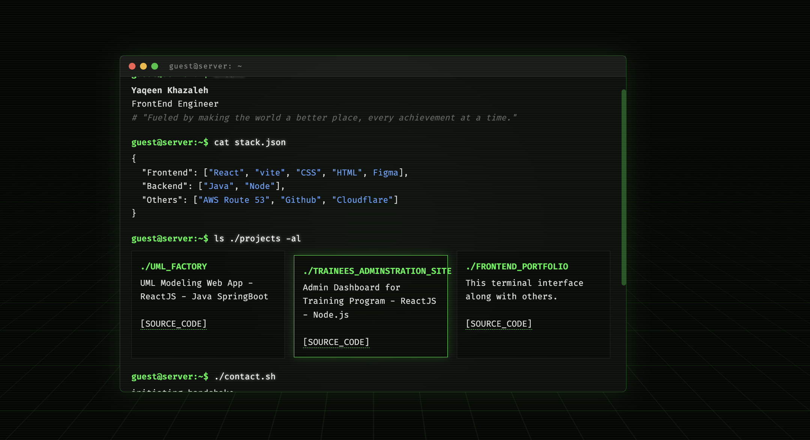
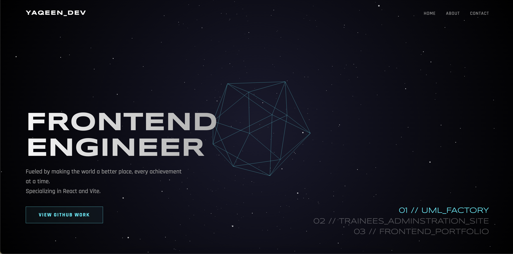

# 🚀 Frontend Portfolio

A modern, multi-style portfolio website showcasing versatile UI/UX capabilities through three distinct interface modes. Built with React and Vite, this project demonstrates proficiency in frontend development, 3D graphics, and creative design.

## Features

### Three Unique Interface Modes

1. ** Terminal Mode**
   - Retro command-line interface
   - Auto-typing animation
   - Cyberpunk aesthetic with scanline effects
   - ASCII art project cards
   - Perfect for developers who appreciate CLI aesthetics

   
   


2. ** Interstellar Mode**
   - Interactive 3D experience using Three.js
   - Animated geometric sphere with particle system
   - Mouse-responsive rotation
   - Breathing animation effects
   - Futuristic sci-fi design

   


3. **★ Spotlight Mode**
   - Clean, modern professional design
   - Glassmorphism card effects
   - Interactive spotlight hover states
   - Comprehensive project showcase
   - Traditional portfolio layout

   
   

##  Tech Stack

- **Frontend Framework:** React 19.2.0
- **Build Tool:** Vite 7.3.1
- **Routing:** React Router DOM 7.13.0
- **3D Graphics:** Three.js 0.182.0
- **Styling:** Custom CSS with modern features
- **Fonts:** Google Fonts (Rajdhani, Inter, Fira Code, Syncopate)

## Installation

### Prerequisites
- Node.js (v16 or higher)
- npm or yarn

### Setup

1. **Clone the repository**
   ```bash
   git clone https://github.com/yaqeen-i/Frontend-Portfolio.git
   cd Frontend-Portfolio
   ```

2. **Install dependencies**
   ```bash
   npm install
   ```

3. **Start development server**
   ```bash
   npm run dev
   ```

4. **Build for production**
   ```bash
   npm run build
   ```

5. **Preview production build**
   ```bash
   npm run preview
   ```

##  Available Scripts

| Command | Description |
|---------|-------------|
| `npm run dev` | Start development server with hot reload |
| `npm run build` | Build optimized production bundle |
| `npm run preview` | Preview production build locally |
| `npm run lint` | Run ESLint for code quality checks |

## Project Structure

```
my-portfolio/
├── public/
│   └── vite.svg
├── src/
│   ├── assets/
│   │   └── react.svg
│   ├── pages/
│   │   ├── MainPage.jsx           # Landing page with mode selection
│   │   ├── Terminal.jsx            # Terminal interface mode
│   │   ├── interstellarPortfolio.jsx  # 3D interactive mode
│   │   └── SpotlightPortfolio.jsx  # Professional portfolio mode
│   ├── styles/
│   │   ├── MainPage.css
│   │   ├── Terminal.css
│   │   ├── interstellarPortfolio.css
│   │   └── SpotlightPortfolio.css
│   ├── App.jsx                     # Main app component with routing
│   ├── App.css
│   ├── index.css                   # Global styles
│   └── main.jsx                    # Entry point
├── index.html
├── package.json
├── vite.config.js
└── README.md
```

##  Usage

### Navigation

The portfolio features a main hub landing page where users can select their preferred interface:

- **Route:** `/` - Main selection hub
- **Route:** `/terminal` - Terminal mode
- **Route:** `/interstellar` - Interstellar 3D mode
- **Route:** `/spotlight` - Spotlight professional mode

### Customization

To customize the portfolio with your own information:

1. **Update Personal Information:**
   - Edit contact details in each mode's component
   - Modify project information in the respective files

2. **Modify Projects:**
   - Terminal: Update `scriptData` array in `Terminal.jsx`
   - Interstellar: Edit project links in `interstellarPortfolio.jsx`
   - Spotlight: Modify project cards in `SpotlightPortfolio.jsx`

3. **Styling:**
   - Each mode has its own CSS file in `src/styles/`
   - Global styles in `src/index.css`
   - CSS custom properties (variables) for easy theming

## Design Highlights

### Terminal Mode
- Cyberpunk green-on-black color scheme
- Animated grid background with perspective
- Scanline CRT monitor effect
- Glassmorphism terminal window
- Typewriter animation for commands

### Interstellar Mode
- Three.js powered 3D graphics
- Particle system with 700+ stars
- Mouse-interactive sphere rotation
- Breathing scale animation
- Fog effects for depth perception

### Spotlight Mode
- Minimalist dark theme
- Interactive spotlight hover effects
- Smooth glassmorphism cards
- Gradient text effects
- Professional layout with clean typography

## Browser Support

- Chrome/Edge (latest)
- Firefox (latest)
- Safari (latest)
- Opera (latest)

## Responsive Design

All three modes are optimized for:
- Desktop (1920x1080 and above)
- Laptop (1280x720)
- Tablet (768px width)
- Mobile (320px and above)

## Development Notes

### Performance Considerations
- Three.js resources are properly disposed on unmount
- Event listeners are cleaned up in useEffect returns
- Vite provides optimized build with code splitting
- CSS animations use GPU-accelerated properties

### Known Issues
- Three.js canvas may flash on hot reload in development (normal behavior)
- Some CSS effects may not work in older browsers

## License

This project is open source and available under the [MIT License](LICENSE).

## Author

**Yaqeen Khazaleh**
- Frontend Engineer
- Email: yaqeen.hamza98@gmail.com
- GitHub: [@yaqeen-i](https://github.com/yaqeen-i)
- Phone: +962 7 7686 6493

##  Acknowledgments

- Three.js community for excellent 3D library and documentation


---

**Made with love and 2 cups of coffee :0 **

*Fueled by making the world a better place, every achievement at a time.*
