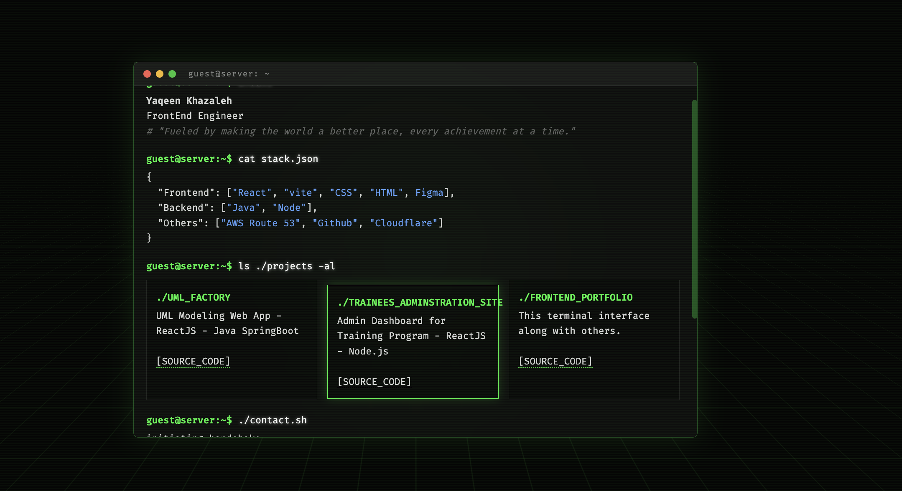
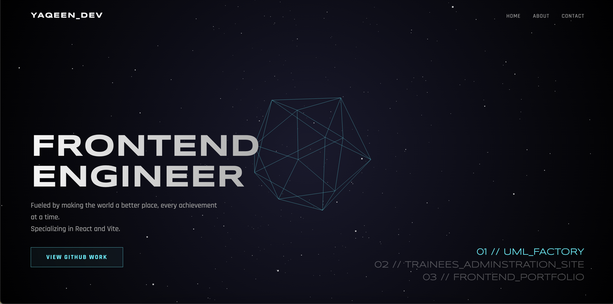
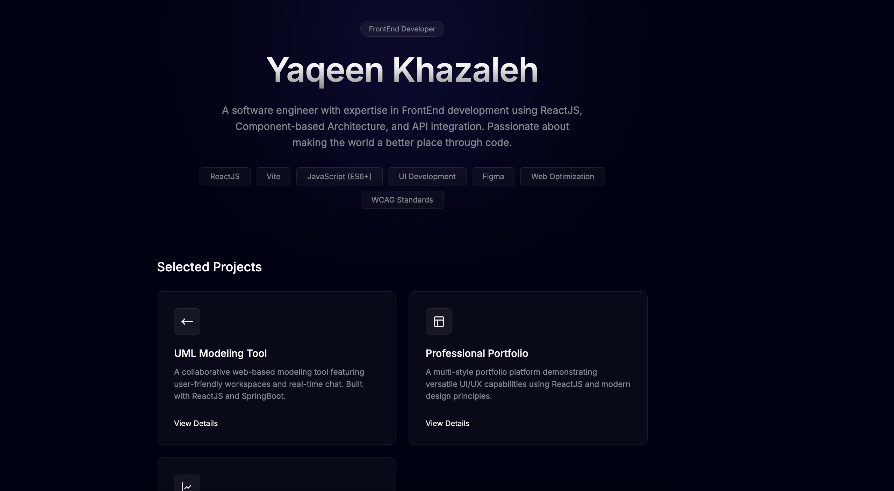

# Yaqeen Khazaleh — Developer Portfolio

A multi-mode personal portfolio for me **Yaqeen Khazaleh**, a DevOps & Backend Engineer based in Jordan. Built with React 19 + Vite, the site lets visitors choose between three completely different interface styles depending on their preference.

---

## The Three Modes

### `>_` Terminal



Simulates a live shell session with a typewriter effect. Commands run automatically, printing structured output for each section. Styled with a cyberpunk green-on-black palette, animated perspective grid background, CRT scanline overlay, and a glassmorphism terminal window.

### `⚛` Interstellar



Three.js scene with:
- A wireframe `IcosahedronGeometry` that rotates and responds to mouse position
- 700-particle star field rendered via `BufferGeometry` + `PointsMaterial`
- Exponential fog (`FogExp2`) for depth
- A breathing scale animation driven by `Math.sin(elapsedTime)`
- Smooth lerp-based mouse tracking on the sphere rotation

Content overlays the canvas as a fixed UI layer with a nav, hero text, and a project list.

### `★` Spotlight



Classic dark portfolio layout with:
- A spotlight glow effect on each card, driven by `mousemove` → CSS `--x` / `--y` custom properties
- Glassmorphism cards (`backdrop-filter: blur`)
- Sections for Projects, Experience, Tech Stack pills, and Contact

---

## About Yaqeen

**Yaqeen Khazaleh** — DevOps Engineer & Full-Stack Developer

> *"Fueled by making the world a better place, every achievement at a time."*

**Current role:** DevOps Engineer @ Quiqflow *(Oct 2025 – Present, Remote)*
**Previous role:** Backend Developer @ OpsHeaven *(Aug 2025 – Oct 2025)*

### Skills

| Layer | Technologies |
|---|---|
| Frontend | React, Vite, CSS, HTML, Figma |
| Backend | Java (Spring Boot), Node.js / Express.js |
| DevOps | AWS (ECS, S3, CloudFront, EC2), GitHub Actions CI/CD, Docker, Cloudflare, Bash |

**Notable DevOps wins:**
- Reduced CI/CD deployment times by 12–15% via GitHub Actions optimization
- Shrunk Docker image sizes from 1.7–2 GB down to 300–400 MB using multi-stage builds
- Maintained 99% uptime on AWS infrastructure

---

## Projects

### UML Factory
Collaborative web-based UML modeling tool with real-time workspaces and chat.
Stack: **ReactJS (Vite) + Java Spring Boot**
→ [github.com/yaqeen-i/UMLFactory](https://github.com/yaqeen-i/UMLFactory)

### Trainees Administration System
Client and admin interfaces for managing a training program. Focused on smooth UI, performance, and cross-browser compatibility.
Stack: **ReactJS + Node.js**
→ [github.com/yaqeen-i/Trainees-Adminstration-System](https://github.com/yaqeen-i/Trainees-Adminstration-System)

### This Portfolio
The site you're looking at — three interface modes in one React app.
→ [github.com/yaqeen-i/Portfolio](https://github.com/yaqeen-i/Portfolio)

---

## Tech Stack (this project)

- **React** 19.2.0
- **React Router DOM** 7.13.0
- **Three.js** 0.182.0
- **Vite** 7.3.1
- **Google Fonts** — Fira Code, Rajdhani, Inter, Syncopate
- Deployed on **Netlify** (SPA redirect configured in `netlify.toml`)

---

## Project Structure

```
src/
├── pages/
│   ├── MainPage.jsx               # Mode selection hub  (route: /)
│   ├── Terminal.jsx               # CLI interface       (route: /terminal)
│   ├── interstellarPortfolio.jsx  # Three.js 3D view    (route: /interstellar)
│   └── SpotlightPortfolio.jsx     # Professional layout (route: /spotlight)
└── styles/
    ├── MainPage.css
    ├── Terminal.css
    ├── InterstellarPortfolio.css
    └── SpotlightPortfolio.css
```

---

## Setup

```bash
git clone https://github.com/yaqeen-i/Frontend-Portfolio.git
cd Frontend-Portfolio
npm install
npm run dev
```

| Command | Description |
|---|---|
| `npm run dev` | Dev server with HMR |
| `npm run build` | Production build → `/dist` |
| `npm run preview` | Serve the production build |
| `npm run lint` | ESLint check |

**Node.js v20+ required** (Vite 7 + React 19 constraint).

---

## Contact

- **Email:** yaqeen.hamza98@gmail.com
- **GitHub:** [@yaqeen-i](https://github.com/yaqeen-i)
- **Phone:** +962 77 686 6493

---

MIT License